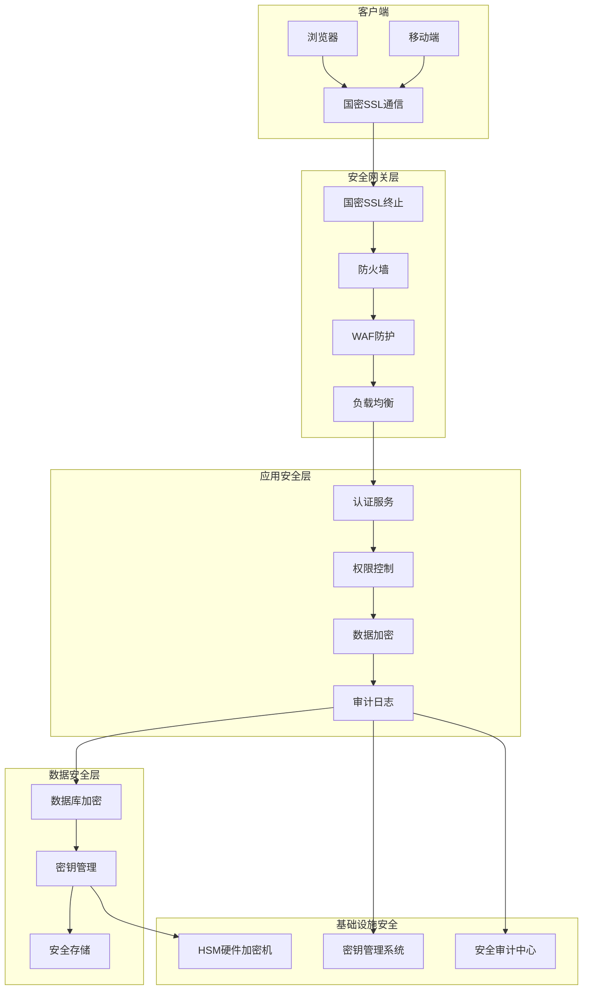

# 安全和认证设计文档（国密算法）

## 1. 安全架构概述

### 1.1 设计目标

1. **国密合规**：全面支持国家密码管理局认可的密码算法
2. **数据安全**：保护静态数据和传输数据的机密性、完整性
3. **身份认证**：强身份认证机制，防止身份伪造
4. **访问控制**：细粒度的权限控制，遵循最小权限原则
5. **审计追踪**：完整的安全事件日志，满足合规要求
6. **安全运维**：密钥管理、安全配置、漏洞管理

### 1.2 国密算法体系

| 算法类型 | 标准号 | 用途 | 特点 |
|---------|--------|------|------|
| **SM2** | GM/T 0003 | 非对称加密、数字签名 | 256位密钥，安全性高 |
| **SM3** | GM/T 0004 | 哈希算法 | 输出256位摘要，抗碰撞性强 |
| **SM4** | GM/T 0002 | 对称加密 | 128位密钥，速度快 |
| **SM9** | GM/T 0044 | 基于身份的密码 | 简化证书管理 |

### 1.3 安全架构图



## 2. 国密算法实现

### 2.1 SM2算法实现

#### 2.1.1 Go语言实现

```go
// pkg/crypto/sm2.go
package crypto

import (
    "crypto/rand"
    "encoding/hex"
    "errors"
    "math/big"

    "github.com/tjfoc/gmsm/sm2"
    "github.com/tjfoc/gmsm/x509"
)

// SM2KeyPair SM2密钥对
type SM2KeyPair struct {
    PrivateKey *sm2.PrivateKey
    PublicKey  *sm2.PublicKey
}

// GenerateSM2KeyPair 生成SM2密钥对
func GenerateSM2KeyPair() (*SM2KeyPair, error) {
    privateKey, err := sm2.GenerateKey(rand.Reader)
    if err != nil {
        return nil, err
    }

    return &SM2KeyPair{
        PrivateKey: privateKey,
        PublicKey:  &privateKey.PublicKey,
    }, nil
}

// SM2Encrypt SM2加密
func SM2Encrypt(publicKey *sm2.PublicKey, plaintext []byte) ([]byte, error) {
    if publicKey == nil {
        return nil, errors.New("public key is nil")
    }

    cipherText, err := publicKey.Encrypt(rand.Reader, plaintext, nil)
    if err != nil {
        return nil, err
    }

    return cipherText, nil
}

// SM2Decrypt SM2解密
func SM2Decrypt(privateKey *sm2.PrivateKey, cipherText []byte) ([]byte, error) {
    if privateKey == nil {
        return nil, errors.New("private key is nil")
    }

    plaintext, err := privateKey.Decrypt(rand.Reader, cipherText, nil)
    if err != nil {
        return nil, err
    }

    return plaintext, nil
}

// SM2Sign SM2签名
func SM2Sign(privateKey *sm2.PrivateKey, hash []byte) ([]byte, error) {
    if privateKey == nil {
        return nil, errors.New("private key is nil")
    }

    signature, err := privateKey.Sign(rand.Reader, hash, nil)
    if err != nil {
        return nil, err
    }

    return signature, nil
}

// SM2Verify SM2验签
func SM2Verify(publicKey *sm2.PublicKey, hash, signature []byte) bool {
    if publicKey == nil {
        return false
    }

    return publicKey.Verify(hash, signature, nil)
}

// ParsePublicKeyFromHex 从十六进制字符串解析公钥
func ParsePublicKeyFromHex(hexKey string) (*sm2.PublicKey, error) {
    keyBytes, err := hex.DecodeString(hexKey)
    if err != nil {
        return nil, err
    }

    publicKey, err := x509.ParseSm2PublicKey(keyBytes)
    if err != nil {
        return nil, err
    }

    return publicKey, nil
}
```

#### 2.1.2 JavaScript实现

```typescript
// xingran-react-frontend/src/utils/sm2.ts
import { sm2 } from 'sm-crypto'

export class SM2Crypto {
  constructor() {
    this.sm2 = new SM2()
  }

  // 生成密钥对
  generateKeyPair() {
    return this.sm2.generateKeyPairHex()
  }

  // 加密
  encrypt(publicKey, plaintext) {
    return this.sm2.doEncrypt(plaintext, publicKey, {
      output: 'c1c2c3'
    })
  }

  // 解密
  decrypt(privateKey, ciphertext) {
    return this.sm2.doDecrypt(ciphertext, privateKey, {
      output: 'c1c2c3'
    })
  }

  // 签名
  sign(privateKey, data) {
    const hash = this.sm3Hash(data)
    return this.sm2.doSignature(hash, privateKey, {
      output: 'c1c2c3'
    })
  }

  // 验签
  verify(publicKey, data, signature) {
    const hash = this.sm3Hash(data)
    return this.sm2.doVerifySignature(hash, signature, publicKey, {
      output: 'c1c2c3'
    })
  }

  // SM3哈希
  sm3Hash(data) {
    return SM3.hash(data)
  }
}
```

### 2.2 SM3算法实现

#### 2.2.1 Go语言实现

```go
// pkg/crypto/sm3.go
package crypto

import (
    "encoding/hex"
    "github.com/tjfoc/gmsm/sm3"
)

// SM3Hash 计算SM3哈希值
func SM3Hash(data []byte) string {
    hash := sm3.Sm3Sum(data)
    return hex.EncodeToString(hash)
}

// SM3HashString 计算字符串的SM3哈希值
func SM3HashString(data string) string {
    return SM3Hash([]byte(data))
}

// SM3Hmac 计算HMAC-SM3
func SM3Hmac(key, data []byte) string {
    mac := sm3.NewHmac(key)
    mac.Write(data)
    return hex.EncodeToString(mac.Sum(nil))
}

// SM3FileHash 计算文件的SM3哈希值
func SM3FileHash(filePath string) (string, error) {
    hash, err := sm3.Sm3File(filePath)
    if err != nil {
        return "", err
    }
    return hex.EncodeToString(hash), nil
}

// SM3Digest SM3摘要结构
type SM3Digest struct {
    sm3.Hash
}

// NewSM3Digest 创建新的SM3摘要
func NewSM3Digest() *SM3Digest {
    return &SM3Digest{*sm3.New()}
}

// WriteString 写入字符串
func (d *SM3Digest) WriteString(s string) error {
    _, err := d.Write([]byte(s))
    return err
}

// HexSum 返回十六进制摘要
func (d *SM3Digest) HexSum() string {
    return hex.EncodeToString(d.Sum(nil))
}
```

### 2.3 SM4算法实现

#### 2.3.1 Go语言实现

```go
// pkg/crypto/sm4.go
package crypto

import (
    "crypto/rand"
    "encoding/hex"
    "errors"

    "github.com/tjfoc/gmsm/sm4"
)

// SM4KeySize SM4密钥长度
const SM4KeySize = 16

// SM4BlockSize SM4块大小
const SM4BlockSize = 16

// SM4 SM4加密器
type SM4 struct {
    key []byte
}

// NewSM4 创建SM4实例
func NewSM4(key []byte) (*SM4, error) {
    if len(key) != SM4KeySize {
        return nil, errors.New("invalid key size")
    }

    return &SM4{key: key}, nil
}

// GenerateSM4Key 生成SM4密钥
func GenerateSM4Key() ([]byte, error) {
    key := make([]byte, SM4KeySize)
    _, err := rand.Read(key)
    if err != nil {
        return nil, err
    }
    return key, nil
}

// EncryptECB ECB模式加密
func (s *SM4) EncryptECB(plaintext []byte) ([]byte, error) {
    if len(plaintext)%SM4BlockSize != 0 {
        // PKCS7填充
        padLen := SM4BlockSize - (len(plaintext) % SM4BlockSize)
        padding := make([]byte, padLen)
        for i := range padding {
            padding[i] = byte(padLen)
        }
        plaintext = append(plaintext, padding...)
    }

    cipherText, err := sm4.Sm4Ecb(s.key, plaintext, true)
    if err != nil {
        return nil, err
    }

    return cipherText, nil
}

// DecryptECB ECB模式解密
func (s *SM4) DecryptECB(cipherText []byte) ([]byte, error) {
    plaintext, err := sm4.Sm4Ecb(s.key, cipherText, false)
    if err != nil {
        return nil, err
    }

    if len(plaintext) == 0 {
        return nil, errors.New("invalid ciphertext")
    }

    // 去除PKCS7填充
    padLen := int(plaintext[len(plaintext)-1])
    if padLen > SM4BlockSize || padLen > len(plaintext) {
        return nil, errors.New("invalid padding")
    }

    for i := len(plaintext) - padLen; i < len(plaintext); i++ {
        if plaintext[i] != byte(padLen) {
            return nil, errors.New("invalid padding")
        }
    }

    return plaintext[:len(plaintext)-padLen], nil
}

// EncryptCBC CBC模式加密
func (s *SM4) EncryptCBC(plaintext, iv []byte) ([]byte, error) {
    if len(iv) != SM4BlockSize {
        return nil, errors.New("invalid iv size")
    }

    // PKCS7填充
    padLen := SM4BlockSize - (len(plaintext) % SM4BlockSize)
    padding := make([]byte, padLen)
    for i := range padding {
        padding[i] = byte(padLen)
    }
    plaintext = append(plaintext, padding...)

    cipherText, err := sm4.Sm4Cbc(s.key, iv, plaintext, true)
    if err != nil {
        return nil, err
    }

    return cipherText, nil
}

// DecryptCBC CBC模式解密
func (s *SM4) DecryptCBC(cipherText, iv []byte) ([]byte, error) {
    if len(iv) != SM4BlockSize {
        return nil, errors.New("invalid iv size")
    }

    plaintext, err := sm4.Sm4Cbc(s.key, iv, cipherText, false)
    if err != nil {
        return nil, err
    }

    if len(plaintext) == 0 {
        return nil, errors.New("invalid ciphertext")
    }

    // 去除PKCS7填充
    padLen := int(plaintext[len(plaintext)-1])
    if padLen > SM4BlockSize || padLen > len(plaintext) {
        return nil, errors.New("invalid padding")
    }

    for i := len(plaintext) - padLen; i < len(plaintext); i++ {
        if plaintext[i] != byte(padLen) {
            return nil, errors.New("invalid padding")
        }
    }

    return plaintext[:len(plaintext)-padLen], nil
}

// EncryptGCM GCM模式加密
func (s *SM4) EncryptGCM(plaintext []byte, additionalData []byte) (nonce, ciphertext, tag []byte, err error) {
    // 生成随机nonce
    nonce = make([]byte, 12) // GCM推荐的nonce长度
    if _, err := rand.Read(nonce); err != nil {
        return nil, nil, nil, err
    }

    // 使用SM4-GCM
    sm4Cipher, err := sm4.NewCipher(s.key)
    if err != nil {
        return nil, nil, nil, err
    }

    gcm, err := cipher.NewGCMWithNonceSize(sm4Cipher, len(nonce))
    if err != nil {
        return nil, nil, nil, err
    }

    ciphertext = gcm.Seal(nil, nonce, plaintext, additionalData)
    tag = ciphertext[len(ciphertext)-gcm.TagSize():]
    ciphertext = ciphertext[:len(ciphertext)-gcm.TagSize()]

    return nonce, ciphertext, tag, nil
}
```

## 3. 认证系统设计

### 3.1 JWT认证实现

#### 3.1.1 国密JWT实现

```go
// pkg/auth/jwt.go
package auth

import (
    "crypto/rand"
    "errors"
    "time"

    "github.com/golang-jwt/jwt/v5"
    "github.com/xingran-next/xingran-go-backend/pkg/crypto"
)

// JWTConfig JWT配置
type JWTConfig struct {
    AccessSecret   string        // 访问密钥
    RefreshSecret  string        // 刷新密钥
    AccessExpire   time.Duration // 访问令牌过期时间
    RefreshExpire  time.Duration // 刷新令牌过期时间
    Issuer         string        // 签发者
    UseSM2         bool          // 是否使用SM2签名
    SM2PrivateKey  string        // SM2私钥
    SM2PublicKey   string        // SM2公钥
}

// TokenClaims JWT声明
type TokenClaims struct {
    UserID   string   `json:"user_id"`
    Username string   `json:"username"`
    Roles    []string `json:"roles"`
    DeviceID string   `json:"device_id,omitempty"`
    jwt.RegisteredClaims
}

// JWTAuthenticator JWT认证器
type JWTAuthenticator struct {
    config JWTConfig
    sm2KeyPair *crypto.SM2KeyPair
}

// NewJWTAuthenticator 创建JWT认证器
func NewJWTAuthenticator(config JWTConfig) (*JWTAuthenticator, error) {
    auth := &JWTAuthenticator{
        config: config,
    }

    if config.UseSM2 {
        if config.SM2PrivateKey == "" || config.SM2PublicKey == "" {
            return nil, errors.New("SM2 keys are required when UseSM2 is true")
        }

        // 解析SM2密钥对
        privateKey, err := crypto.ParsePrivateKeyFromHex(config.SM2PrivateKey)
        if err != nil {
            return nil, err
        }

        publicKey, err := crypto.ParsePublicKeyFromHex(config.SM2PublicKey)
        if err != nil {
            return nil, err
        }

        auth.sm2KeyPair = &crypto.SM2KeyPair{
            PrivateKey: privateKey,
            PublicKey:  publicKey,
        }
    }

    return auth, nil
}

// GenerateTokens 生成访问令牌和刷新令牌
func (j *JWTAuthenticator) GenerateTokens(userID, username, deviceID string, roles []string) (accessToken, refreshToken string, err error) {
    now := time.Now()

    // 生成访问令牌
    accessClaims := &TokenClaims{
        UserID:   userID,
        Username: username,
        Roles:    roles,
        DeviceID: deviceID,
        RegisteredClaims: jwt.RegisteredClaims{
            Issuer:    j.config.Issuer,
            Subject:   userID,
            IssuedAt:  jwt.NewNumericDate(now),
            ExpiresAt: jwt.NewNumericDate(now.Add(j.config.AccessExpire)),
            NotBefore: jwt.NewNumericDate(now),
            ID:        generateJTI(),
        },
    }

    accessToken, err = j.generateToken(accessClaims, j.config.AccessSecret)
    if err != nil {
        return "", "", err
    }

    // 生成刷新令牌
    refreshClaims := &TokenClaims{
        UserID:   userID,
        Username: username,
        DeviceID: deviceID,
        RegisteredClaims: jwt.RegisteredClaims{
            Issuer:    j.config.Issuer,
            Subject:   userID,
            IssuedAt:  jwt.NewNumericDate(now),
            ExpiresAt: jwt.NewNumericDate(now.Add(j.config.RefreshExpire)),
            NotBefore: jwt.NewNumericDate(now),
            ID:        generateJTI(),
        },
    }

    refreshToken, err = j.generateToken(refreshClaims, j.config.RefreshSecret)
    if err != nil {
        return "", "", err
    }

    return accessToken, refreshToken, nil
}

// generateToken 生成令牌
func (j *JWTAuthenticator) generateToken(claims *TokenClaims, secret string) (string, error) {
    if j.config.UseSM2 {
        return j.generateSM2Token(claims)
    }
    return j.generateHMACToken(claims, secret)
}

// generateHMACToken 生成HMAC令牌
func (j *JWTAuthenticator) generateHMACToken(claims *TokenClaims, secret string) (string, error) {
    token := jwt.NewWithClaims(jwt.SigningMethodHS256, claims)
    return token.SignedString([]byte(secret))
}

// generateSM2Token 生成SM2签名令牌
func (j *JWTAuthenticator) generateSM2Token(claims *TokenClaims) (string, error) {
    // 使用自定义签名方法
    signingMethod := &SM2SigningMethod{
        privateKey: j.sm2KeyPair.PrivateKey,
        publicKey:  j.sm2KeyPair.PublicKey,
    }

    token := jwt.NewWithClaims(signingMethod, claims)

    // 生成JWT字符串
    tokenString, err := token.SigningString()
    if err != nil {
        return "", err
    }

    // 使用SM2签名
    hash := crypto.SM3Hash([]byte(tokenString))
    signature, err := crypto.SM2Sign(j.sm2KeyPair.PrivateKey, []byte(hash))
    if err != nil {
        return "", err
    }

    return tokenString + "." + hex.EncodeToString(signature), nil
}

// VerifyToken 验证令牌
func (j *JWTAuthenticator) VerifyToken(tokenString string, isRefresh bool) (*TokenClaims, error) {
    if j.config.UseSM2 {
        return j.verifySM2Token(tokenString)
    }

    secret := j.config.AccessSecret
    if isRefresh {
        secret = j.config.RefreshSecret
    }

    return j.verifyHMACToken(tokenString, secret)
}

// verifyHMACToken 验证HMAC令牌
func (j *JWTAuthenticator) verifyHMACToken(tokenString, secret string) (*TokenClaims, error) {
    token, err := jwt.ParseWithClaims(tokenString, &TokenClaims{}, func(token *jwt.Token) (interface{}, error) {
        if _, ok := token.Method.(*jwt.SigningMethodHMAC); !ok {
            return nil, jwt.ErrSignatureInvalid
        }
        return []byte(secret), nil
    })

    if err != nil {
        return nil, err
    }

    if claims, ok := token.Claims.(*TokenClaims); ok && token.Valid {
        return claims, nil
    }

    return nil, jwt.ErrInvalidKey
}

// verifySM2Token 验证SM2令牌
func (j *JWTAuthenticator) verifySM2Token(tokenString string) (*TokenClaims, error) {
    parts := strings.Split(tokenString, ".")
    if len(parts) != 3 {
        return nil, jwt.ErrTokenMalformed
    }

    // 验证签名
    message := parts[0] + "." + parts[1]
    hash := crypto.SM3Hash([]byte(message))

    signature, err := hex.DecodeString(parts[2])
    if err != nil {
        return nil, jwt.ErrTokenMalformed
    }

    if !crypto.SM2Verify(j.sm2KeyPair.PublicKey, []byte(hash), signature) {
        return nil, jwt.ErrSignatureInvalid
    }

    // 解析Claims
    token, err := jwt.ParseWithClaims(tokenString, &TokenClaims{}, func(token *jwt.Token) (interface{}, error) {
        return nil, nil // 已经验证过签名
    })

    if err != nil {
        return nil, err
    }

    if claims, ok := token.Claims.(*TokenClaims); ok {
        // 验证过期时间
        if claims.ExpiresAt != nil && claims.ExpiresAt.Before(time.Now()) {
            return nil, jwt.ErrTokenExpired
        }
        return claims, nil
    }

    return nil, jwt.ErrInvalidKey
}

// generateJTI 生成JWT ID
func generateJTI() string {
    b := make([]byte, 16)
    rand.Read(b)
    return hex.EncodeToString(b)
}

// SM2SigningMethod SM2签名方法
type SM2SigningMethod struct {
    privateKey *sm2.PrivateKey
    publicKey  *sm2.PublicKey
}

func (m *SM2SigningMethod) Alg() string {
    return "SM2"
}

func (m *SM2SigningMethod) Verify(signingString string, sig []byte, key interface{}) error {
    // 实现验证逻辑
    return nil
}

func (m *SM2SigningMethod) Sign(signingString string, key interface{}) ([]byte, error) {
    // 实现签名逻辑
    return nil, nil
}
```

### 3.2 密码安全

#### 3.2.1 密码加密策略

```go
// pkg/auth/password.go
package auth

import (
    "crypto/rand"
    "encoding/base64"
    "errors"
    "regexp"
    "time"

    "github.com/xingran-next/xingran-go-backend/pkg/crypto"
)

// PasswordPolicy 密码策略
type PasswordPolicy struct {
    MinLength        int           `yaml:"min_length"`         // 最小长度
    MaxLength        int           `yaml:"max_length"`         // 最大长度
    RequireUppercase bool          `yaml:"require_uppercase"`  // 需要大写字母
    RequireLowercase bool          `yaml:"require_lowercase"`  // 需要小写字母
    RequireNumber    bool          `yaml:"require_number"`     // 需要数字
    RequireSpecial   bool          `yaml:"require_special"`    // 需要特殊字符
    ForbiddenChars   []string      `yaml:"forbidden_chars"`    // 禁用字符
    HistoryCount     int           `yaml:"history_count"`      // 密码历史数量
    MaxAge           time.Duration `yaml:"max_age"`            // 密码最大有效期
    MaxFailedAttempt int           `yaml:"max_failed_attempt"` // 最大失败次数
    LockoutDuration  time.Duration `yaml:"lockout_duration"`   // 锁定时间
}

// PasswordHash 密码哈希结构
type PasswordHash struct {
    Algorithm string    `json:"algorithm"` // 算法名称
    Salt      string    `json:"salt"`      // 盐值
    Hash      string    `json:"hash"`      // 哈希值
    Iterations int      `json:"iterations"` // 迭代次数
    CreatedAt time.Time `json:"created_at"` // 创建时间
}

// PasswordManager 密码管理器
type PasswordManager struct {
    policy PasswordPolicy
}

// NewPasswordManager 创建密码管理器
func NewPasswordManager(policy PasswordPolicy) *PasswordManager {
    return &PasswordManager{policy: policy}
}

// ValidatePassword 验证密码策略
func (pm *PasswordManager) ValidatePassword(password string) error {
    if len(password) < pm.policy.MinLength {
        return errors.New("password too short")
    }

    if len(password) > pm.policy.MaxLength {
        return errors.New("password too long")
    }

    if pm.policy.RequireUppercase {
        matched, _ := regexp.MatchString("[A-Z]", password)
        if !matched {
            return errors.New("password must contain uppercase letters")
        }
    }

    if pm.policy.RequireLowercase {
        matched, _ := regexp.MatchString("[a-z]", password)
        if !matched {
            return errors.New("password must contain lowercase letters")
        }
    }

    if pm.policy.RequireNumber {
        matched, _ := regexp.MatchString("[0-9]", password)
        if !matched {
            return errors.New("password must contain numbers")
        }
    }

    if pm.policy.RequireSpecial {
        matched, _ := regexp.MatchString(`[!@#$%^&*(),.?":{}|<>]`, password)
        if !matched {
            return errors.New("password must contain special characters")
        }
    }

    for _, char := range pm.policy.ForbiddenChars {
        if strings.Contains(password, char) {
            return errors.New("password contains forbidden characters")
        }
    }

    return nil
}

// HashPassword 生成密码哈希
func (pm *PasswordManager) HashPassword(password string) (*PasswordHash, error) {
    // 生成盐值
    salt, err := generateSalt()
    if err != nil {
        return nil, err
    }

    // 使用PBKDF2 + SM3
    iterations := 10000
    hash := pbkdf2SM3(password, salt, iterations)

    return &PasswordHash{
        Algorithm:  "PBKDF2-SM3",
        Salt:       base64.StdEncoding.EncodeToString(salt),
        Hash:       base64.StdEncoding.EncodeToString(hash),
        Iterations: iterations,
        CreatedAt:  time.Now(),
    }, nil
}

// VerifyPassword 验证密码
func (pm *PasswordManager) VerifyPassword(password string, hash *PasswordHash) bool {
    salt, err := base64.StdEncoding.DecodeString(hash.Salt)
    if err != nil {
        return false
    }

    expectedHash, err := base64.StdEncoding.DecodeString(hash.Hash)
    if err != nil {
        return false
    }

    actualHash := pbkdf2SM3(password, salt, hash.Iterations)
    return subtle.ConstantTimeCompare(actualHash, expectedHash) == 1
}

// IsPasswordExpired 检查密码是否过期
func (pm *PasswordManager) IsPasswordExpired(hash *PasswordHash) bool {
    if pm.policy.MaxAge == 0 {
        return false
    }
    return time.Since(hash.CreatedAt) > pm.policy.MaxAge
}

// generateSalt 生成盐值
func generateSalt() ([]byte, error) {
    salt := make([]byte, 32)
    _, err := rand.Read(salt)
    return salt, err
}

// pbkdf2SM3 PBKDF2 with SM3
func pbkdf2SM3(password string, salt []byte, iterations int) []byte {
    // 实现PBKDF2-SM3算法
    // 这里简化实现，实际应使用标准库
    h := crypto.SM3HashString(password + string(salt))
    for i := 0; i < iterations-1; i++ {
        h = crypto.SM3HashString(h)
    }
    return []byte(h)
}

// PasswordHistory 密码历史
type PasswordHistory struct {
    UserID      string       `json:"user_id"`
    Hashes      []PasswordHash `json:"hashes"`
    UpdatedAt   time.Time    `json:"updated_at"`
}

// IsPasswordInHistory 检查密码是否在历史中
func (pm *PasswordManager) IsPasswordInHistory(password string, history *PasswordHistory) bool {
    for _, hash := range history.Hashes {
        if pm.VerifyPassword(password, &hash) {
            return true
        }
    }
    return false
}

// AddPasswordHistory 添加密码到历史
func (pm *PasswordManager) AddPasswordHistory(history *PasswordHistory, hash *PasswordHash) {
    history.Hashes = append(history.Hashes, *hash)
    history.UpdatedAt = time.Now()

    // 保留最近N个密码
    if len(history.Hashes) > pm.policy.HistoryCount {
        history.Hashes = history.Hashes[len(history.Hashes)-pm.policy.HistoryCount:]
    }
}
```

## 4. 数据加密

### 4.1 敏感数据加密

```go
// pkg/crypto/encryption.go
package crypto

import (
    "bytes"
    "compress/gzip"
    "encoding/base64"
    "io"
)

// DataEncryptor 数据加密器
type DataEncryptor struct {
    sm4Key []byte
}

// NewDataEncryptor 创建数据加密器
func NewDataEncryptor(key []byte) (*DataEncryptor, error) {
    if len(key) != SM4KeySize {
        return nil, errors.New("invalid key size")
    }

    return &DataEncryptor{sm4Key: key}, nil
}

// EncryptField 加密字段
func (de *DataEncryptor) EncryptField(plaintext string) (string, error) {
    if plaintext == "" {
        return "", nil
    }

    // 生成随机IV
    iv := make([]byte, SM4BlockSize)
    if _, err := rand.Read(iv); err != nil {
        return "", err
    }

    // 压缩数据
    compressed, err := compressData([]byte(plaintext))
    if err != nil {
        return "", err
    }

    // 加密
    sm4, err := NewSM4(de.sm4Key)
    if err != nil {
        return "", err
    }

    ciphertext, err := sm4.EncryptCBC(compressed, iv)
    if err != nil {
        return "", err
    }

    // 组合IV和密文
    result := append(iv, ciphertext...)
    return base64.StdEncoding.EncodeToString(result), nil
}

// DecryptField 解密字段
func (de *DataEncryptor) DecryptField(ciphertext string) (string, error) {
    if ciphertext == "" {
        return "", nil
    }

    // Base64解码
    data, err := base64.StdEncoding.DecodeString(ciphertext)
    if err != nil {
        return "", err
    }

    if len(data) < SM4BlockSize {
        return "", errors.New("invalid ciphertext")
    }

    // 分离IV和密文
    iv := data[:SM4BlockSize]
    encrypted := data[SM4BlockSize:]

    // 解密
    sm4, err := NewSM4(de.sm4Key)
    if err != nil {
        return "", err
    }

    compressed, err := sm4.DecryptCBC(encrypted, iv)
    if err != nil {
        return "", err
    }

    // 解压缩
    plaintext, err := decompressData(compressed)
    if err != nil {
        return "", err
    }

    return string(plaintext), nil
}

// compressData 压缩数据
func compressData(data []byte) ([]byte, error) {
    var buf bytes.Buffer
    gz := gzip.NewWriter(&buf)
    if _, err := gz.Write(data); err != nil {
        return nil, err
    }
    if err := gz.Close(); err != nil {
        return nil, err
    }
    return buf.Bytes(), nil
}

// decompressData 解压缩数据
func decompressData(data []byte) ([]byte, error) {
    gz, err := gzip.NewReader(bytes.NewReader(data))
    if err != nil {
        return nil, err
    }
    defer gz.Close()

    return io.ReadAll(gz)
}

// EncryptBulk 批量加密
func (de *DataEncryptor) EncryptBulk(data map[string]string) (map[string]string, error) {
    result := make(map[string]string)
    var err error

    for key, value := range data {
        result[key], err = de.EncryptField(value)
        if err != nil {
            return nil, err
        }
    }

    return result, nil
}

// DecryptBulk 批量解密
func (de *DataEncryptor) DecryptBulk(data map[string]string) (map[string]string, error) {
    result := make(map[string]string)
    var err error

    for key, value := range data {
        result[key], err = de.DecryptField(value)
        if err != nil {
            return nil, err
        }
    }

    return result, nil
}
```

### 4.2 数据脱敏

```go
// pkg/crypto/masking.go
package crypto

import (
    "regexp"
    "strings"
)

// DataMasker 数据脱敏器
type DataMasker struct{}

// NewDataMasker 创建数据脱敏器
func NewDataMasker() *DataMasker {
    return &DataMasker{}
}

// MaskEmail 邮箱脱敏
func (dm *DataMasker) MaskEmail(email string) string {
    if email == "" {
        return ""
    }

    parts := strings.Split(email, "@")
    if len(parts) != 2 {
        return email
    }

    username := parts[0]
    domain := parts[1]

    if len(username) <= 2 {
        return email
    }

    // 保留前两位和最后一位
    masked := username[:2] + strings.Repeat("*", len(username)-3) + username[len(username)-1:]
    return masked + "@" + domain
}

// MaskPhone 手机号脱敏
func (dm *DataMasker) MaskPhone(phone string) string {
    if phone == "" {
        return ""
    }

    // 保留前三位和后四位
    re := regexp.MustCompile(`(\d{3})\d{4}(\d{4})`)
    return re.ReplaceAllString(phone, "$1****$2")
}

// MaskIDCard 身份证脱敏
func (dm *DataMasker) MaskIDCard(idCard string) string {
    if idCard == "" {
        return ""
    }

    if len(idCard) < 8 {
        return idCard
    }

    // 保留前三位和后四位
    return idCard[:3] + strings.Repeat("*", len(idCard)-7) + idCard[len(idCard)-4:]
}

// MaskBankCard 银行卡脱敏
func (dm *DataMasker) MaskBankCard(cardNo string) string {
    if cardNo == "" {
        return ""
    }

    if len(cardNo) < 8 {
        return cardNo
    }

    // 保留前四位和后四位
    return cardNo[:4] + strings.Repeat("*", len(cardNo)-8) + cardNo[len(cardNo)-4:]
}

// MaskName 姓名脱敏
func (dm *DataMasker) MaskName(name string) string {
    if name == "" {
        return ""
    }

    runes := []rune(name)
    if len(runes) <= 1 {
        return name
    }

    if len(runes) == 2 {
        return string(runes[0]) + "*"
    }

    // 保留第一位和最后一位
    return string(runes[0]) + strings.Repeat("*", len(runes)-2) + string(runes[len(runes)-1])
}

// MaskAddress 地址脱敏
func (dm *DataMasker) MaskAddress(address string) string {
    if address == "" {
        return ""
    }

    // 保留前6个字符和后6个字符
    if len(address) <= 12 {
        return strings.Repeat("*", len(address))
    }

    return address[:6] + strings.Repeat("*", len(address)-12) + address[len(address)-6:]
}

// MaskCustom 自定义脱敏
func (dm *DataMasker) MaskCustom(value string, prefixLen, suffixLen int) string {
    if value == "" {
        return ""
    }

    if len(value) <= prefixLen+suffixLen {
        return strings.Repeat("*", len(value))
    }

    return value[:prefixLen] + strings.Repeat("*", len(value)-prefixLen-suffixLen) + value[len(value)-suffixLen:]
}

// MaskAccordingToType 根据类型脱敏
func (dm *DataMasker) MaskAccordingToType(dataType, value string) string {
    switch strings.ToUpper(dataType) {
    case "EMAIL":
        return dm.MaskEmail(value)
    case "PHONE":
        return dm.MaskPhone(value)
    case "ID_CARD":
        return dm.MaskIDCard(value)
    case "BANK_CARD":
        return dm.MaskBankCard(value)
    case "NAME":
        return dm.MaskName(value)
    case "ADDRESS":
        return dm.MaskAddress(value)
    default:
        return value
    }
}
```

### 4.x 网络设备写端点加密行为

v1.19 起 `/network/ports/write/*` 6 端点（shutdown / undo-shutdown / description / dot1x-enable / dot1x-disable / batch）**保持** SM2+SM4 HTTP 请求体加密，**不**加入 `request_encryption.exclude_paths` 豁免列表（D-04 锁定）。

#### 4.x.1 两层加密正交说明

本系统涉及两个正交的"加密"层，必须区分以避免混淆：

| 层 | 协议 | 实现 | 范围 |
|----|------|------|------|
| **SSH transport 加密** | TCP/SSH (RFC 4253) | scrapligo 自管（Go crypto/ssh + aes256-ctr/cbc 等标准算法） | 后端 → 网络设备 |
| **HTTP 请求体加密** | HTTP/1.1 over HTTPS | `pkg/middleware/encryption.go` + SM2 密钥交换 + SM4-CBC body | 前端 → 后端 API |

两层不互相替代：

- SSH transport 是 scrapligo 与网络设备之间的连接加密，**与 HTTP 中间件无关**，不经过 `pkg/middleware/encryption.go`
- HTTP SM2+SM4 是浏览器 → Gin → `encryption.go` 中间件 → handler 的请求体解密

#### 4.x.2 写端点加密实证

`configs/config.yaml:88-117` `request_encryption.exclude_paths` 实证（v1.19 落地后保持不变）：

```yaml
request_encryption:
  enabled: true
  exclude_paths:
    - "/api/v1/system/auth/public-key"
    - "/api/v1/system/auth/test-sm2"
    - "/api/v1/upload/*"
    - "/api/v1/captcha/*"
    - "/api/v1/rpa/workers/register"
    - "/api/v1/rpa/workers/*/heartbeat"
    - "/api/v1/rpa/workers/progress"
    # 注意：/network/ports/write/* 不在列表 → 写端点保持 SM2+SM4 加密
```

SC#3 锁定：写端点保持加密理由——shutdown / dot1x / description 是生产网络敏感操作，request body 含 `portId` + `reason`（操作原因审计字段），豁免会降低传输安全性，违背等保合规。

#### 4.x.3 与 SSH 加密正交验证

写端点的 SSH transport 加密（scrapligo 自管）独立于 HTTP SM2+SM4 加密：

1. 前端 SM2+SM4 加密 request body → HTTPS POST 到 `/network/ports/write/shutdown`
2. `pkg/middleware/encryption.go` 解密 body → handler 拿到明文 `{portId, reason}`
3. Handler 调 `PortWriteService.Shutdown(ctx, portID, operator)`
4. Service 通过 `deviceExecutor.ExecuteCustom` 调 `wrapper.SendConfigs(cmds)` → scrapligo 用 SSH 标准算法（aes256-ctr + 兼容 CBC 老设备）建立 SSH transport → 设备端

任何写端点若被提议加入 `exclude_paths`（即豁免 SM2+SM4），应拒绝——HTTP 加密与 SSH 加密是两个独立维度，前者保护前端→后端链路，后者保护后端→设备链路，**不能互相替代**。

## 5. 传输安全

### 5.1 国密SSL配置

```go
// pkg/tls/gmtls.go
package tls

import (
    "crypto/tls"
    "crypto/x509"
    "errors"
    "io/ioutil"
    "time"

    "github.com/tjfoc/gmtls"
    "golang.org/x/crypto/acme/autocert"
)

// GMConfig 国密TLS配置
type GMConfig struct {
    CertFile     string // SM2证书文件
    KeyFile      string // SM2私钥文件
    CAFile       string // CA证书文件
    EncCertFile  string // 双证书加密证书
    EncKeyFile   string // 双证书加密私钥
    AutoCert     bool   // 是否自动获取证书
    CacheDir     string // 证书缓存目录
    Hosts        []string // 证书域名
    MinVersion   uint16 // 最小TLS版本
    CipherSuites []uint16 // 加密套件
}

// NewGMTLSServerConfig 创建国密TLS服务器配置
func NewGMTLSServerConfig(config GMConfig) (*tls.Config, error) {
    if config.AutoCert {
        return newAutoCertConfig(config)
    }

    return newManualCertConfig(config)
}

// newManualCertConfig 手动证书配置
func newManualCertConfig(config GMConfig) (*tls.Config, error) {
    // 加载签名证书和私钥
    cert, err := gmtls.LoadX509KeyPair(config.CertFile, config.KeyFile)
    if err != nil {
        return nil, err
    }

    // 加载加密证书和私钥（如果有）
    var encCert tls.Certificate
    if config.EncCertFile != "" && config.EncKeyFile != "" {
        encCert, err = gmtls.LoadX509KeyPair(config.EncCertFile, config.EncKeyFile)
        if err != nil {
            return nil, err
        }
    }

    // 创建国密证书
    gmCert := &gmtls.GMCertificate{
        Certificate: cert,
        EncCertificate: &encCert,
    }

    // 加载CA证书
    var caPool *x509.CertPool
    if config.CAFile != "" {
        caData, err := ioutil.ReadFile(config.CAFile)
        if err != nil {
            return nil, err
        }

        caPool = x509.NewCertPool()
        if !caPool.AppendCertsFromPEM(caData) {
            return nil, errors.New("failed to parse CA certificate")
        }
    }

    // 配置TLS
    tlsConfig := &gmtls.Config{
        Certificates: []gmtls.Certificate{*gmCert},
        ClientAuth:   gmtls.RequireAndVerifyClientCert,
        ClientCAs:    caPool,
        MinVersion:   gmtls.VersionTLS12,
        CipherSuites: []uint16{
            gmtls.GMTLS_SM2_WITH_SM4_SM3,
            gmtls.GMTLS_SM2_WITH_SM4_GCM_SM3,
            gmtls.GMTLS_ECDHE_SM2_WITH_SM4_GCM_SM3,
        },
        NextProtos: []string{"h2", "http/1.1"},
    }

    return &tls.Config{
        Certificates: tlsConfig.Certificates,
        ClientAuth:   tlsConfig.ClientAuth,
        ClientCAs:    tlsConfig.ClientCAs,
        MinVersion:   tlsConfig.MinVersion,
        CipherSuites: tlsConfig.CipherSuites,
        NextProtos:   tlsConfig.NextProtos,
    }, nil
}

// newAutoCertConfig 自动证书配置
func newAutoCertConfig(config GMConfig) (*tls.Config, error) {
    m := &autocert.Manager{
        Prompt:     autocert.AcceptTOS,
        HostPolicy: autocert.HostWhitelist(config.Hosts...),
        Cache:      autocert.DirCache(config.CacheDir),
    }

    return &tls.Config{
        GetCertificate: m.GetCertificate,
        MinVersion:    tls.VersionTLS12,
        CipherSuites: []uint16{
            gmtls.GMTLS_SM2_WITH_SM4_SM3,
            gmtls.GMTLS_SM2_WITH_SM4_GCM_SM3,
            gmtls.GMTLS_ECDHE_SM2_WITH_SM4_GCM_SM3,
        },
        NextProtos: m.HostPolicy,
    }, nil
}

// GetGMTLSClientConfig 获取国密TLS客户端配置
func GetGMTLSClientConfig(certFile, keyFile, caFile string) (*tls.Config, error) {
    // 加载客户端证书和私钥
    cert, err := gmtls.LoadX509KeyPair(certFile, keyFile)
    if err != nil {
        return nil, err
    }

    // 加载CA证书
    caData, err := ioutil.ReadFile(caFile)
    if err != nil {
        return nil, err
    }

    caPool := x509.NewCertPool()
    if !caPool.AppendCertsFromPEM(caData) {
        return nil, errors.New("failed to parse CA certificate")
    }

    return &tls.Config{
        Certificates: []tls.Certificate{cert},
        RootCAs:      caPool,
        MinVersion:   tls.VersionTLS12,
        CipherSuites: []uint16{
            gmtls.GMTLS_SM2_WITH_SM4_SM3,
            gmtls.GMTLS_SM2_WITH_SM4_GCM_SM3,
            gmtls.GMTLS_ECDHE_SM2_WITH_SM4_GCM_SM3,
        },
    }, nil
}
```

## 6. 权限控制

### 6.1 RBAC权限模型

```go
// pkg/auth/rbac.go
package auth

import (
    "context"
    "errors"
    "sync"
)

// Permission 权限
type Permission struct {
    ID          string   `json:"id"`
    Name        string   `json:"name"`
    Code        string   `json:"code"`
    Resource    string   `json:"resource"`
    Action      string   `json:"action"`
    Description string   `json:"description"`
    Type        string   `json:"type"` // menu, button, api, data
}

// Role 角色
type Role struct {
    ID          string   `json:"id"`
    Name        string   `json:"name"`
    Code        string   `json:"code"`
    Description string   `json:"description"`
    Status      int      `json:"status"`
    DataScope   string   `json:"data_scope"` // all, dept, dept_and_child, self, custom
    Permissions []string `json:"permissions"`
}

// User 用户
type User struct {
    ID         string   `json:"id"`
    Username   string   `json:"username"`
    Status     int      `json:"status"`
    DeptID     string   `json:"dept_id"`
    Roles      []string `json:"roles"`
    Permissions []string `json:"permissions"`
}

// RBACManager RBAC管理器
type RBACManager struct {
    users       map[string]*User
    roles       map[string]*Role
    permissions map[string]*Permission
    rolePerms   map[string][]string // role -> permissions
    userPerms   map[string][]string // user -> permissions
    mu          sync.RWMutex
}

// NewRBACManager 创建RBAC管理器
func NewRBACManager() *RBACManager {
    return &RBACManager{
        users:       make(map[string]*User),
        roles:       make(map[string]*Role),
        permissions: make(map[string]*Permission),
        rolePerms:   make(map[string][]string),
        userPerms:   make(map[string][]string),
    }
}

// AddUser 添加用户
func (rm *RBACManager) AddUser(user *User) error {
    rm.mu.Lock()
    defer rm.mu.Unlock()

    if _, exists := rm.users[user.ID]; exists {
        return errors.New("user already exists")
    }

    rm.users[user.ID] = user
    rm.updateUserPermissions(user.ID)

    return nil
}

// AddRole 添加角色
func (rm *RBACManager) AddRole(role *Role) error {
    rm.mu.Lock()
    defer rm.mu.Unlock()

    if _, exists := rm.roles[role.ID]; exists {
        return errors.New("role already exists")
    }

    rm.roles[role.ID] = role
    rm.rolePerms[role.ID] = role.Permissions

    // 更新所有拥有该角色的用户的权限
    for _, user := range rm.users {
        for _, roleID := range user.Roles {
            if roleID == role.ID {
                rm.updateUserPermissions(user.ID)
                break
            }
        }
    }

    return nil
}

// AddPermission 添加权限
func (rm *RBACManager) AddPermission(perm *Permission) error {
    rm.mu.Lock()
    defer rm.mu.Unlock()

    if _, exists := rm.permissions[perm.ID]; exists {
        return errors.New("permission already exists")
    }

    rm.permissions[perm.ID] = perm
    return nil
}

// CheckPermission 检查用户权限
func (rm *RBACManager) CheckPermission(userID string, resource, action string) bool {
    rm.mu.RLock()
    defer rm.mu.RUnlock()

    user, exists := rm.users[userID]
    if !exists || user.Status != 1 {
        return false
    }

    // 检查用户权限
    for _, permID := range rm.userPerms[userID] {
        if perm, exists := rm.permissions[permID]; exists {
            if perm.Resource == resource && perm.Action == action {
                return true
            }
        }
    }

    return false
}

// CheckPermissionByCode 根据权限编码检查
func (rm *RBACManager) CheckPermissionByCode(userID, permCode string) bool {
    rm.mu.RLock()
    defer rm.mu.RUnlock()

    user, exists := rm.users[userID]
    if !exists || user.Status != 1 {
        return false
    }

    // 检查用户权限
    for _, permID := range rm.userPerms[userID] {
        if perm, exists := rm.permissions[permID]; exists {
            if perm.Code == permCode {
                return true
            }
        }
    }

    return false
}

// GetUserPermissions 获取用户权限列表
func (rm *RBACManager) GetUserPermissions(userID string) []Permission {
    rm.mu.RLock()
    defer rm.mu.RUnlock()

    var permissions []Permission
    for _, permID := range rm.userPerms[userID] {
        if perm, exists := rm.permissions[permID]; exists {
            permissions = append(permissions, *perm)
        }
    }

    return permissions
}

// HasRole 检查用户是否拥有角色
func (rm *RBACManager) HasRole(userID, roleCode string) bool {
    rm.mu.RLock()
    defer rm.mu.RUnlock()

    user, exists := rm.users[userID]
    if !exists {
        return false
    }

    for _, roleID := range user.Roles {
        if role, exists := rm.roles[roleID]; exists {
            if role.Code == roleCode {
                return true
            }
        }
    }

    return false
}

// CheckDataScope 检查数据权限
func (rm *RBACManager) CheckDataScope(userID, targetDeptID string) bool {
    rm.mu.RLock()
    defer rm.mu.RUnlock()

    user, exists := rm.users[userID]
    if !exists {
        return false
    }

    // 检查角色的数据权限
    for _, roleID := range user.Roles {
        role, exists := rm.roles[roleID]
        if !exists {
            continue
        }

        switch role.DataScope {
        case "all":
            return true
        case "dept":
            return user.DeptID == targetDeptID
        case "dept_and_child":
            // 需要检查是否是子部门
            return rm.isChildDept(user.DeptID, targetDeptID)
        case "self":
            // 只能访问自己的数据
            return false
        }
    }

    return false
}

// updateUserPermissions 更新用户权限
func (rm *RBACManager) updateUserPermissions(userID string) {
    user, exists := rm.users[userID]
    if !exists {
        return
    }

    permMap := make(map[string]bool)

    // 收集角色的权限
    for _, roleID := range user.Roles {
        if perms, exists := rm.rolePerms[roleID]; exists {
            for _, permID := range perms {
                permMap[permID] = true
            }
        }
    }

    // 转换为切片
    var perms []string
    for permID := range permMap {
        perms = append(perms, permID)
    }

    rm.userPerms[userID] = perms
}

// isChildDept 检查是否是子部门（简化实现）
func (rm *RBACManager) isChildDept(parentDeptID, childDeptID string) bool {
    // 实际实现需要查询部门表
    return parentDeptID == childDeptID
}
```

## 7. 安全审计

### 7.1 安全事件记录

```go
// pkg/audit/security.go
package audit

import (
    "context"
    "encoding/json"
    "time"
)

// SecurityEventType 安全事件类型
type SecurityEventType string

const (
    EventLogin         SecurityEventType = "login"          // 登录
    EventLogout        SecurityEventType = "logout"         // 登出
    EventLoginFailed   SecurityEventType = "login_failed"   // 登录失败
    EventPasswordChange SecurityEventType = "password_change" // 密码修改
    EventPermissionDenied SecurityEventType = "permission_denied" // 权限拒绝
    EventDataAccess    SecurityEventType = "data_access"    // 数据访问
    EventDataExport    SecurityEventType = "data_export"    // 数据导出
    EventConfigChange  SecurityEventType = "config_change"  // 配置变更
    EventKeyOperation  SecurityEventType = "key_operation"  // 密钥操作
)

// SecurityEvent 安全事件
type SecurityEvent struct {
    ID          string                 `json:"id"`
    Type        SecurityEventType      `json:"type"`
    UserID      string                 `json:"user_id"`
    Username    string                 `json:"username"`
    IPAddress   string                 `json:"ip_address"`
    UserAgent   string                 `json:"user_agent"`
    Resource    string                 `json:"resource"`
    Action      string                 `json:"action"`
    Result      string                 `json:"result"`       // success, failed
    Reason      string                 `json:"reason"`       // 失败原因
    Details     map[string]interface{} `json:"details"`      // 详细信息
    Timestamp   time.Time              `json:"timestamp"`
    RiskLevel   string                 `json:"risk_level"`   // low, medium, high, critical
    SessionID   string                 `json:"session_id"`
    TraceID     string                 `json:"trace_id"`
}

// SecurityAuditor 安全审计器
type SecurityAuditor struct {
    eventStore EventStore
    alertChan  chan *SecurityEvent
}

// EventStore 事件存储接口
type EventStore interface {
    Store(ctx context.Context, event *SecurityEvent) error
    Query(ctx context.Context, filter *EventFilter) ([]*SecurityEvent, error)
    Count(ctx context.Context, filter *EventFilter) (int64, error)
}

// EventFilter 事件过滤器
type EventFilter struct {
    UserID      string            `json:"user_id"`
    Type        SecurityEventType `json:"type"`
    IPAddress   string            `json:"ip_address"`
    StartTime   time.Time         `json:"start_time"`
    EndTime     time.Time         `json:"end_time"`
    RiskLevel   string            `json:"risk_level"`
    Result      string            `json:"result"`
    Limit       int               `json:"limit"`
    Offset      int               `json:"offset"`
}

// NewSecurityAuditor 创建安全审计器
func NewSecurityAuditor(store EventStore) *SecurityAuditor {
    auditor := &SecurityAuditor{
        eventStore: store,
        alertChan:  make(chan *SecurityEvent, 1000),
    }

    // 启动告警处理协程
    go auditor.processAlerts()

    return auditor
}

// LogEvent 记录安全事件
func (sa *SecurityAuditor) LogEvent(ctx context.Context, event *SecurityEvent) error {
    // 设置事件ID和时间戳
    if event.ID == "" {
        event.ID = generateEventID()
    }
    if event.Timestamp.IsZero() {
        event.Timestamp = time.Now()
    }

    // 评估风险等级
    event.RiskLevel = sa.evaluateRisk(event)

    // 存储事件
    err := sa.eventStore.Store(ctx, event)
    if err != nil {
        return err
    }

    // 发送告警
    if event.RiskLevel == "high" || event.RiskLevel == "critical" {
        select {
        case sa.alertChan <- event:
        default:
            // 通道满，丢弃告警
        }
    }

    return nil
}

// LogLogin 记录登录事件
func (sa *SecurityAuditor) LogLogin(ctx context.Context, userID, username, ip, userAgent, sessionID string, success bool, reason string) error {
    result := "success"
    if !success {
        result = "failed"
    }

    event := &SecurityEvent{
        Type:      EventLogin,
        UserID:    userID,
        Username:  username,
        IPAddress: ip,
        UserAgent: userAgent,
        Result:    result,
        Reason:    reason,
        SessionID: sessionID,
    }

    if !success {
        event.Type = EventLoginFailed
    }

    return sa.LogEvent(ctx, event)
}

// LogPermissionDenied 记录权限拒绝事件
func (sa *SecurityAuditor) LogPermissionDenied(ctx context.Context, userID, username, ip, resource, action string, reason string) error {
    event := &SecurityEvent{
        Type:      EventPermissionDenied,
        UserID:    userID,
        Username:  username,
        IPAddress: ip,
        Resource:  resource,
        Action:    action,
        Result:    "failed",
        Reason:    reason,
    }

    return sa.LogEvent(ctx, event)
}

// LogDataAccess 记录数据访问事件
func (sa *SecurityAuditor) LogDataAccess(ctx context.Context, userID, username, ip, resource, action string, details map[string]interface{}) error {
    event := &SecurityEvent{
        Type:      EventDataAccess,
        UserID:    userID,
        Username:  username,
        IPAddress: ip,
        Resource:  resource,
        Action:    action,
        Result:    "success",
        Details:   details,
    }

    return sa.LogEvent(ctx, event)
}

// evaluateRisk 评估风险等级
func (sa *SecurityAuditor) evaluateRisk(event *SecurityEvent) string {
    // 根据事件类型和结果评估风险
    switch event.Type {
    case EventLoginFailed:
        // 连续登录失败
        if sa.countRecentFailures(event.UserID, event.IPAddress) >= 5 {
            return "high"
        }
        return "medium"

    case EventPermissionDenied:
        // 权限拒绝
        if event.Resource == "admin" {
            return "high"
        }
        return "low"

    case EventDataExport:
        // 大量数据导出
        if details, ok := event.Details["count"]; ok {
            if count, ok := details.(float64); ok && count > 1000 {
                return "medium"
            }
        }
        return "low"

    case EventKeyOperation:
        // 密钥操作
        return "critical"

    default:
        return "low"
    }
}

// countRecentFailures 统计最近的失败次数
func (sa *SecurityAuditor) countRecentFailures(userID, ipAddress string) int {
    filter := &EventFilter{
        UserID:    userID,
        IPAddress: ipAddress,
        Type:      EventLoginFailed,
        StartTime: time.Now().Add(-15 * time.Minute),
        EndTime:   time.Now(),
    }

    count, _ := sa.eventStore.Count(context.Background(), filter)
    return int(count)
}

// processAlerts 处理告警
func (sa *SecurityAuditor) processAlerts() {
    for event := range sa.alertChan {
        // 发送告警通知
        sa.sendAlert(event)
    }
}

// sendAlert 发送告警
func (sa *SecurityAuditor) sendAlert(event *SecurityEvent) {
    // 实现告警发送逻辑
    // 可以是邮件、短信、钉钉等方式
    alertData, _ := json.Marshal(event)

    // 发送到告警系统
    // ...
}

// generateEventID 生成事件ID
func generateEventID() string {
    // 生成唯一的事件ID
    return uuid.New().String()
}
```

## 8. 安全配置

### 8.1 安全配置示例

```yaml
# config/security.yaml
security:
  # 密码策略
  password_policy:
    min_length: 8
    max_length: 128
    require_uppercase: true
    require_lowercase: true
    require_number: true
    require_special: true
    forbidden_chars: ["'", "\"", "<", ">", "&"]
    history_count: 5
    max_age: 90d
    max_failed_attempt: 5
    lockout_duration: 30m

  # 会话配置
  session:
    timeout: 30m
    renew_timeout: 7d
    max_concurrent: 3
    single_sign_on: true

  # 国密配置
  gmtls:
    cert_file: "/etc/certs/server-sm2.crt"
    key_file: "/etc/certs/server-sm2.key"
    ca_file: "/etc/certs/ca.crt"
    enc_cert_file: "/etc/certs/server-enc-sm2.crt"
    enc_key_file: "/etc/certs/server-enc-sm2.key"
    min_version: "1.2"
    cipher_suites:
      - "GMTLS_SM2_WITH_SM4_SM3"
      - "GMTLS_SM2_WITH_SM4_GCM_SM3"

  # JWT配置
  jwt:
    use_sm2: true
    access_expire: 30m
    refresh_expire: 7d
    issuer: "xingran-next"
    sm2_private_key: "/etc/keys/sm2-private.key"
    sm2_public_key: "/etc/keys/sm2-public.key"

  # 数据加密
  encryption:
    master_key: "encrypted_master_key_here"
    algorithm: "SM4-CBC"
    key_rotation_interval: 90d

  # 审计配置
  audit:
    enabled: true
    log_level: "info"
    retention: 365d
    real_time_alert: true
    alert_channels:
      - type: "email"
        config:
          smtp_host: "smtp.example.com"
          smtp_port: 587
          username: "alert@example.com"
          password: "encrypted_password"
          recipients: ["admin@example.com"]
      - type: "webhook"
        config:
          url: "https://alerts.example.com/webhook"
          secret: "webhook_secret"

  # 访问控制
  access_control:
    ip_whitelist: []
    ip_blacklist:
      - "192.168.1.100"
    rate_limit:
      enabled: true
      requests_per_minute: 100
      burst: 200
    cors:
      enabled: true
      allowed_origins:
        - "https://admin.example.com"
        - "https://app.example.com"
      allowed_methods:
        - "POST"
      allowed_headers:
        - "Content-Type"
        - "Authorization"

  # 安全头
  security_headers:
    x_frame_options: "DENY"
    x_content_type_options: "nosniff"
    x_xss_protection: "1; mode=block"
    strict_transport_security: "max-age=31536000; includeSubDomains"
    content_security_policy: "default-src 'self'"
```

## 9. 安全最佳实践

### 9.1 安全检查清单

```markdown
## 应用安全检查清单

### 认证安全
- [ ] 使用强密码策略
- [ ] 实施密码历史记录
- [ ] 实现密码复杂度检查
- [ ] 使用国密算法加密密码
- [ ] 实施账户锁定机制
- [ ] 实施多因素认证
- [ ] 定期要求修改密码

### 会话安全
- [ ] 使用安全的会话ID生成
- [ ] 设置合理的会话超时
- [ ] 实施会话固定保护
- [ ] 安全地销毁会话
- [ ] 限制并发会话数
- [ ] 实施单点登录

### 数据保护
- [ ] 加密敏感数据存储
- [ ] 使用国密算法
- [ ] 实施数据脱敏
- [ ] 定期更换加密密钥
- [ ] 安全地管理密钥
- [ ] 备份加密数据

### 传输安全
- [ ] 使用国密SSL/TLS
- [ ] 禁用不安全的协议
- [ ] 验证证书有效性
- [ ] 实施证书固定
- [ ] 加密所有通信
- [ ] 使用安全的配置

### 访问控制
- [ ] 实施最小权限原则
- [ ] 定期审查权限
- [ ] 实施RBAC模型
- [ ] 实施数据权限控制
- [ ] 记录访问日志
- [ ] 监控异常访问

### 安全审计
- [ ] 记录所有安全事件
- [ ] 实施实时告警
- [ ] 保留审计日志
- [ ] 定期分析安全事件
- [ ] 实施入侵检测
- [ ] 配置安全监控

### 基础设施安全
- [ ] 使用防火墙
- [ ] 定期更新系统
- [ ] 实施入侵防护
- [ ] 配置安全组
- [ ] 使用安全的基础设施
- [ ] 定期安全扫描
```

## 10. SM2密码传输加密实现

### 10.1 背景

为了增强登录安全性，前端与后端之间的密码传输采用 SM2 非对称加密算法，防止密码在网络传输过程中被窃取。

### 10.2 架构设计

```
┌─────────────────────────────────────────────────────────────┐
│                      登录密码加密流程                          │
├─────────────────────────────────────────────────────────────┤
│                                                              │
│  前端 (React + TypeScript)      后端 (Go + tjfoc/gmsm)      │
│                                                              │
│  1. 获取公钥 ────────────────────> /api/v1/system/auth/     │
│     GET /public-key                public-key                 │
│     返回: 十六进制公钥               (130字符十六进制)          │
│                                                              │
│  2. 密码加密                                                    │
│     明文密码                                                    │
│       │                                                       │
│       ▼                                                       │
│     sm-crypto.doEncrypt(明文, 公钥, mode=0)                  │
│       │                                                       │
│       ▼                                                       │
│     添加04前缀 (sm-crypto缺少此标识)                          │
│       │                                                       │
│       ▼                                                       │
│     hexToBase64()                                            │
│       │                                                       │
│       ▼                                                       │
│     加密密码 (Base64)                                         │
│                                                              │
│  3. 登录请求 ──────────────────────> /api/v1/system/auth/     │
│     POST /login                    login                       │
│     请求体: {                                                  │
│       username: "admin",                                     │
│       password: "Base64密文",                                │
│       encryptedPassword: true                                │
│     }                                                         │
│                                                              │
│  4. 后端解密                                                  │
│     Base64解码 → SM2解密(mode=1) → 明文密码                    │
│     然后使用SM3-PBKDF2验证                                     │
│                                                              │
└─────────────────────────────────────────────────────────────┘
```

### 10.3 兼容性问题解决方案

#### 10.3.1 问题分析

| 特性 | sm-crypto (JavaScript) | tjfoc/gmsm (Go) |
|------|----------------------|-----------------|
| mode 0 | C1C2C3 | C1C2C3 |
| mode 1 | C1C3C2 | C1C3C2 |
| 04前缀 | ❌ 缺少 | ✅ 包含 |
| 密文长度 | 104字节 | 105字节 |

#### 10.3.2 解决方案

**关键发现**：
- sm-crypto 的 mode 0 产生的格式与后端 mode 1 兼容
- 必须手动添加 `04` 前缀（未压缩椭圆曲线点标识符）

**前端实现** (`src/utils/sm2.ts`):

```typescript
import { sm2 } from 'sm-crypto';

export async function fetchPublicKey(): Promise<string> {
  const response = await fetch('/api/v1/system/auth/public-key');
  const result = await response.json();

  if (result.code === 0 && result.data?.publicKey) {
    return result.data.publicKey; // 十六进制格式，130字符
  }
  throw new Error('获取公钥失败');
}

export function encryptWithSM2(password: string, publicKeyHex: string): string {
  // 使用 mode 0 (与后端兼容)
  let cipherText = sm2.doEncrypt(password, publicKeyHex, 0);

  // 添加 04 前缀（未压缩椭圆曲线点标识符）
  if (!cipherText.startsWith('04')) {
    cipherText = '04' + cipherText;
  }

  // 转换为 Base64
  return hexToBase64(cipherText);
}

function hexToBase64(hexString: string): string {
  const bytes = [];
  for (let i = 0; i < hexString.length; i += 2) {
    bytes.push(parseInt(hexString.substr(i, 2), 16));
  }
  return btoa(String.fromCharCode.apply(null, bytes));
}
```

**后端实现** (`pkg/crypto/sm2_jwt.go`):

```go
// ExportPublicKeyToHex 导出公钥为原始十六进制格式
// 返回: 04 + X(32字节) + Y(32字节) = 65字节 (130个十六进制字符)
func ExportPublicKeyToHex(publicKey *sm2.PublicKey) string {
    xBytes := publicKey.X.Bytes()
    yBytes := publicKey.Y.Bytes()

    // 确保X和Y都是32字节
    paddingX := make([]byte, 32-len(xBytes))
    paddingY := make([]byte, 32-len(yBytes))

    // 拼接: 04 + X + Y
    rawBytes := make([]byte, 0, 65)
    rawBytes = append(rawBytes, 0x04) // 非压缩点标识
    rawBytes = append(rawBytes, paddingX...)
    rawBytes = append(rawBytes, xBytes...)
    rawBytes = append(rawBytes, paddingY...)
    rawBytes = append(rawBytes, yBytes...)

    return hex.EncodeToString(rawBytes)
}

// DecryptWithSM2 使用 SM2 私钥解密数据
func DecryptWithSM2(ciphertext string, privateKey *sm2.PrivateKey) (string, error) {
    // Base64 解码
    data, err := base64.StdEncoding.DecodeString(ciphertext)
    if err != nil {
        return "", fmt.Errorf("Base64 解码失败: %w", err)
    }

    // SM2 解密 (使用 C1C3C2 模式，mode = 1)
    plaintext, err := sm2.Decrypt(privateKey, data, 1)
    if err != nil {
        return "", fmt.Errorf("SM2 解密失败: %w", err)
    }

    return string(plaintext), nil
}
```

### 10.4 API 接口

#### 10.4.1 获取公钥

```
GET /api/v1/system/auth/public-key

响应:
{
  "code": 0,
  "data": {
    "publicKey": "04792ab9ee5d65abe4c90114a7812a68ecc84131bdb346b1b0ecf6a4f8dbe7b85af06ed365e387017d9703bb4f1ecb80c40ebfa415bc9d527b47c139433993c16a"
  }
}
```

#### 10.4.2 登录（加密密码）

```
POST /api/v1/system/auth/login

请求体:
{
  "username": "admin",
  "password": "BCXUIfYKjvUS/QYBONwzKvYw7b9EyjbSGeOl77ju...",
  "encryptedPassword": true
}

响应:
{
  "code": 0,
  "data": {
    "user": {...},
    "accessToken": "...",
    "refreshToken": "..."
  }
}
```

### 10.5 密码存储（后端）

虽然传输是加密的，但数据库中仍然使用 SM3-PBKDF2 哈希存储：

```
明文密码
    │
    ▼
SM3-PBKDF2(10000次迭代)
    │
    ▼
存储到数据库
```

### 10.6 关键文件清单

| 文件 | 说明 |
|------|------|
| `pkg/crypto/sm2_jwt.go` | SM2 加密/解密、公钥导出、SM2-JWT 签名 |
| `pkg/crypto/sm4.go` | SM4-CBC 加解密（设备密码、AD 密码、RPA 凭据） |
| `pkg/crypto/request_encryption.go` | SM2 密钥交换 + SM4-CBC 请求体加解密中间件 |
| `internal/core/security/jwt.go` | JWT 管理（双 Token、SM2 签名） |
| `internal/core/security/password.go` | 密码哈希（PBKDF2-SM3，OWASP 配置） |
| `internal/api/v1/system/auth_handler.go` | 认证 API（登录、公钥、刷新 Token） |
| `xingran-react-frontend/src/utils/sm2.ts` | 前端 SM2 加密工具（`sm-crypto` 库封装） |
| `xingran-react-frontend/src/utils/sm4.ts` | 前端 SM4 加密工具 |
| `xingran-react-frontend/src/store/authStore.ts` | 登录状态管理（含 `TokenManager` 自动刷新） |

> **文档说明**：本文 §2 / §3 / §4 / §5 / §6 / §7 给出的 Go 代码片段为**设计契约 / 概念示例**，展示算法与接口的形状；实际实现路径以 §10.6 关键文件清单为准（`pkg/crypto/` 提供国密原语，`internal/core/security/` 提供认证与密码哈希，`pkg/permission/` 提供 RBAC）。占位符 `pkg/auth/`、`pkg/audit/`、`pkg/tls/`、`pkg/crypto/sm2.go` 等不存在——代码定位请直接参考清单。

### 10.7 测试验证

```typescript
// 测试 SM2 加密/解密
import { sm2 } from 'sm-crypto';

const keyPair = sm2.generateKeyPairHex();
const plaintext = 'admin123';
const cipherText = sm2.doEncrypt(plaintext, keyPair.publicKey, 1);
const decrypted = sm2.doDecrypt(cipherText, keyPair.privateKey, 1);
console.log(decrypted === plaintext); // true
```

### 10.8 注意事项

1. **mode 参数**：前端使用 mode 0，后端使用 mode 1
2. **04 前缀**：前端必须手动添加，否则后端无法解密
3. **Base64 编码**：hex 转换为 Base64 时必须每2个字符转为1字节
4. **公钥格式**：后端返回十六进制而非 PEM 格式
5. **密钥管理**：SM2 密钥对应安全存储，建议使用 HSM

### 10.9 安全建议

1. 生产环境必须使用 HTTPS
2. 定期更换 SM2 密钥对
3. 记录加密密码使用的审计日志
4. 监控解密失败次数，防止攻击

## 11. 总结

本安全和认证设计文档详细描述了XingRan-Next项目采用国密算法的安全体系。主要特点包括：

1. **国密算法支持**：全面支持SM2、SM3、SM4国密算法
2. **强认证机制**：JWT + 双令牌 + 密码安全策略
3. **数据加密保护**：传输加密、存储加密、数据脱敏
4. **细粒度权限控制**：RBAC模型 + 数据权限
5. **完整审计追踪**：安全事件记录 + 实时告警
6. **安全合规**：满足国家密码管理局要求
7. **SM2密码传输加密**：前后端使用SM2算法实现安全密码传输

通过这些安全设计，系统能够提供企业级的安全保障，保护数据的机密性、完整性和可用性，满足等保要求。