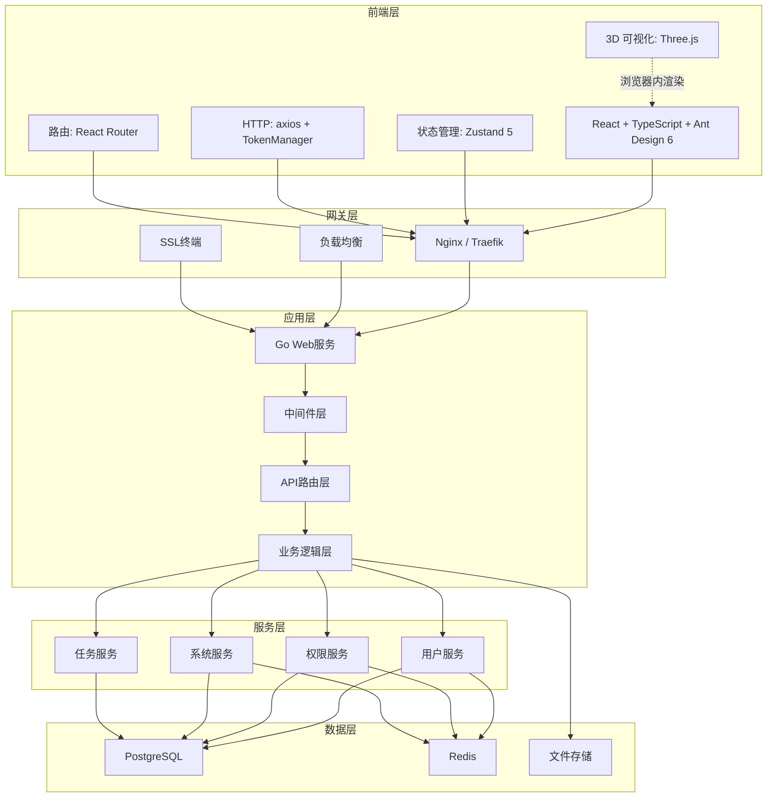
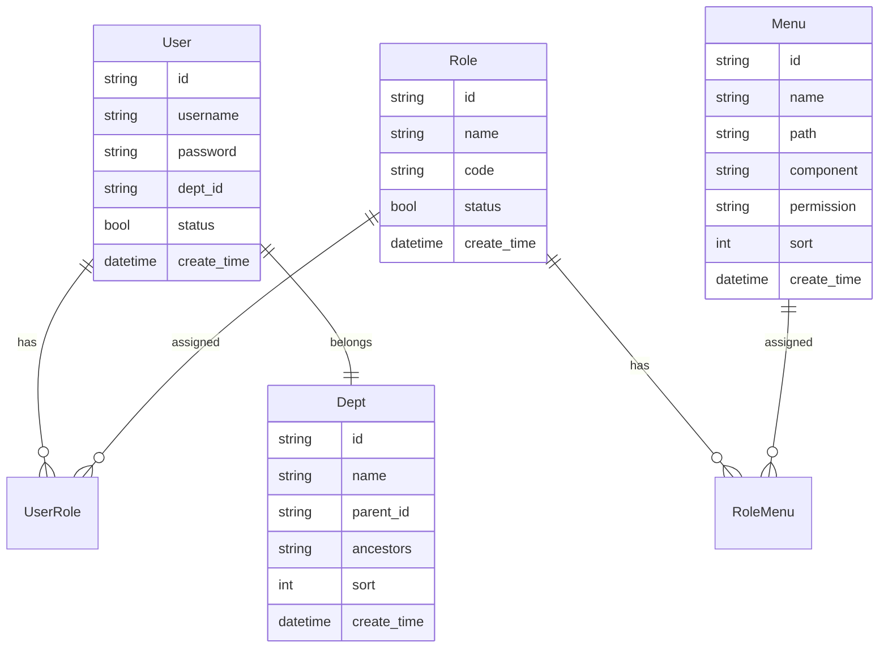

# XingRan-Next 项目概述和架构设计

## 1. 项目概述

### 1.1 项目背景

本项目是基于若依（XingRan）开源管理系统的全新重构版本，旨在解决原有系统的技术债务问题，采用现代化的技术栈和架构设计，构建一个高性能、高可用、易扩展的企业级权限管理系统。

### 1.2 项目目标

- **技术现代化**：采用 Go 语言和 React 技术栈，提升系统性能
- **架构优化**：解决原有系统的架构混乱和技术债务问题
- **功能完整**：实现若依系统的所有核心功能
- **安全增强**：集成国密算法，提升系统安全性
- **易于维护**：清晰的代码结构和完善的文档体系

### 1.3 核心功能模块

| 模块名称 | 功能描述 | 主要特性 |
|---------|---------|---------|
| 用户管理 | 用户信息的增删改查、状态管理、权限分配 | 支持批量操作、密码策略、用户导入导出 |
| 部门管理 | 组织机构配置、树形结构展示 | 多级部门、数据权限继承 |
| 岗位管理 | 用户职务配置、岗位权限管理 | 岗位定义、权限绑定 |
| 菜单管理 | 系统菜单配置、操作权限控制 | 动态菜单、按钮级权限控制 |
| 角色管理 | 角色权限分配、数据范围划分 | RBAC模型、灵活的权限组合 |
| 字典管理 | 系统固定数据维护 | 分类管理、缓存优化 |
| 参数管理 | 系统动态参数配置 | 热更新、参数验证 |
| 通知公告 | 系统消息发布管理 | 多类型通知、已读未读状态 |
| 操作日志 | 用户操作记录查询 | 详细日志、统计分析 |
| 登录日志 | 登录行为记录监控 | 异常登录检测、IP追踪 |
| 在线用户 | 当前活跃用户监控 | 实时状态、强制下线 |
| 定时任务 | 任务调度管理 | 可视化配置、执行日志 |
| 代码生成 | 前后端代码自动生成 | 模板定制、一键生成 |
| 系统接口 | API文档自动生成 | Swagger文档、接口测试 |
| 服务监控 | 系统资源监控 | CPU、内存、磁盘监控 |
| 缓存监控 | Redis缓存状态监控 | 缓存统计、性能分析 |
| 在线构建器 | 表单元素可视化构建 | 拖拽式设计、代码生成 |
| 连接池监控 | 数据库连接池监控 | 性能分析、瓶颈识别 |

## 2. 技术架构

### 2.1 整体架构图



### 2.2 后端技术栈

#### 2.2.1 核心技术选型

| 技术 | 版本 | 用途 | 选择理由 |
|------|------|------|---------|
| Go | 1.24+ | 后端开发语言 | 高性能、高并发、简洁语法 |
| Gin | 1.9+ | Web框架 | 轻量级、高性能、丰富的中间件 |
| GORM | 1.25+ | ORM框架 | 功能完善、支持异步、易用 |
| Redis | 7.4+ | 缓存和会话存储 | 高性能、丰富的数据结构 |
| PostgreSQL | 18.1+ | 主数据库 | 强大的功能、事务支持、JSON支持 |
| JWT | - | 认证授权 | 无状态、跨语言支持（HS256 + SM2 签名可选） |
| 国密算法 | tjfoc/gmsm | SM2/SM3/SM4 | 满足等保合规；前端 sm-crypto 配套 |

#### 2.2.2 框架选择对比

**Web框架对比**
| 框架 | 性能 | 生态 | 文档 | 学习成本 | 推荐度 |
|------|------|------|------|---------|--------|
| Gin | ⭐⭐⭐⭐⭐ | ⭐⭐⭐⭐⭐ | ⭐⭐⭐⭐ | ⭐⭐⭐⭐⭐ | ⭐⭐⭐⭐⭐ |
| Echo | ⭐⭐⭐⭐ | ⭐⭐⭐ | ⭐⭐⭐ | ⭐⭐⭐⭐ | ⭐⭐⭐⭐ |
| Fiber | ⭐⭐⭐⭐⭐ | ⭐⭐ | ⭐⭐⭐ | ⭐⭐⭐ | ⭐⭐⭐ |
| Chi | ⭐⭐⭐⭐ | ⭐⭐⭐⭐ | ⭐⭐⭐⭐ | ⭐⭐⭐⭐ | ⭐⭐⭐⭐ |

### 2.3 前端技术栈

#### 2.3.1 核心技术选型

| 技术 | 版本 | 用途 | 选择理由 |
|------|------|------|---------|
| React | 19.2+ | UI框架 | 生态丰富、组件化开发 |
| TypeScript | 5.9+ | 类型系统 | 类型安全、提升开发效率 |
| Vite | 7.2+ | 构建工具 | 快速的热更新、优化的生产构建 |
| Zustand | 5.0+ | 状态管理 | 轻量级、TypeScript友好（含 TokenManager 自动刷新） |
| React Router | 7.0+ | 路由管理 | 声明式路由、代码分割 |
| Ant Design | 6.1+ | UI组件库 | 企业级组件设计 |
| Three.js | r170+ | 3D 可视化 | 楼宇/楼层 3D 展示 + 楼层平面图 CAD 编辑器（`@react-three/fiber` + `@react-three/drei`） |
| Node.js | 24.12+ | 构建环境 | LTS版本，长期支持 |

> 数据获取：本项目**未引入** TanStack Query。统一通过 `src/lib/api.ts` 的 axios + token 刷新拦截器 + 业务页本地 React Query-free 模式实现；Zustand store 持有跨页状态，分页/筛选由 `useTableManager` 自管。

#### 2.3.2 工具库选择

| 功能 | 库选择 | 版本 | 用途 |
|------|--------|------|------|
| HTTP客户端 | Axios | 1.7+ | API请求 |
| 日期处理 | Day.js | 1.11+ | 日期格式化 |
| 工具函数 | Lodash | 4.17+ | 常用工具函数 |
| 表单处理 | React Hook Form | 7.53+ | 表单管理 |
| 数据验证 | Zod | 3.23+ | 类型验证 |
| 图表库 | ECharts | 5.5+ | 数据可视化 |
| 虚拟滚动 | React Virtual | 2.10+ | 大列表优化 |
| 拖拽排序 | dnd kit | 6.1+ | 拖拽功能 |
| 3D 渲染 | three + @react-three/fiber + @react-three/drei | r170+ | 楼宇/楼层 3D + 楼层平面图 CAD 编辑器 |

### 2.4 架构设计原则

1. **单一职责原则**：每个模块只负责单一的业务功能
2. **开闭原则**：对扩展开放，对修改封闭
3. **依赖倒置原则**：依赖抽象而非具体实现
4. **接口隔离原则**：使用小而专的接口
5. **领域驱动设计**：以业务领域为核心进行建模

## 3. 后端架构设计

### 3.1 分层架构

```
┌─────────────────────────────────────────┐
│            API 接口层                   │
│  - HTTP请求处理                         │
│  - 参数验证                             │
│  - 响应封装                             │
└─────────────────────────────────────────┘
┌─────────────────────────────────────────┐
│            中间件层                     │
│  - 认证授权中间件                       │
│  - 日志记录中间件                       │
│  - 限流熔断中间件                       │
│  - 跨域处理中间件                       │
└─────────────────────────────────────────┘
┌─────────────────────────────────────────┐
│            业务逻辑层                   │
│  - 业务规则实现                         │
│  - 事务管理                             │
│  - 领域服务                             │
└─────────────────────────────────────────┘
┌─────────────────────────────────────────┐
│            数据访问层                   │
│  - 数据库操作                           │
│  - 缓存操作                             │
│  - 持久化实现                           │
└─────────────────────────────────────────┘
```

### 3.2 目录结构

```
xingran-next/
├── cmd/                          # 应用入口
│   ├── server/                   # Web服务
│   │   └── main.go              # 服务启动入口
│   ├── worker/                   # 后台任务
│   │   └── main.go              # 任务处理器入口
│   └── migrate/                  # 数据库迁移
│       └── main.go              # 迁移工具
├── internal/                     # 内部代码
│   ├── api/                      # API层
│   │   ├── v1/                   # API v1版本
│   │   │   ├── auth/            # 认证接口
│   │   │   ├── system/          # 系统模块（用户/角色/菜单等）
│   │   │   ├── operations/      # 运维管理模块
│   │   │   ├── monitor/         # 监控模块
│   │   │   └── middleware/      # 中间件
│   ├── services/                 # 业务服务层
│   │   ├── system/              # 系统服务（含缓存实现）
│   │   │   ├── user_service.go
│   │   │   ├── role_service.go
│   │   │   ├── role_cache_impl.go    # 带缓存的角色服务
│   │   │   ├── post_service.go
│   │   │   ├── post_cache_impl.go    # 带缓存的岗位服务
│   │   │   ├── cache_provider.go     # 缓存提供者接口
│   │   │   └── cache_utils.go        # 缓存工具函数
│   │   ├── data_cache_service.go     # 通用缓存服务
│   │   └── cache_config_service.go   # 缓存配置服务
│   ├── models/                   # 数据模型
│   ├── core/                     # 核心模块
│   │   ├── core.go              # Core 结构体
│   │   ├── db/                  # 数据库连接
│   │   ├── security/            # 安全模块（JWT/密码）
│   │   └── scheduler/           # 定时调度器
│   ├── device/                   # 设备管理
│   ├── collectors/               # 数据采集器
│   └── utils/                    # 内部工具
├── pkg/                         # 公共包
│   ├── cache/                   # 缓存封装
│   │   ├── cache.go            # 缓存接口
│   │   ├── redis.go            # Redis 实现
│   │   ├── memory.go           # 内存缓存实现
│   │   └── multilevel.go       # 多级缓存实现
│   ├── middleware/              # 中间件
│   ├── permission/              # 权限控制
│   ├── crypto/                  # 国密算法
│   ├── query/                   # 查询构建器
│   ├── response/                # 响应封装
│   └── utils/                   # 通用工具
├── scripts/                     # 脚本文件
├── configs/                     # 配置文件
├── docs/                        # 项目文档
└── tests/                       # 测试文件
```

### 3.3 API设计规范

#### 3.3.1 RESTful API设计

| 资源 | HTTP方法 | URL | 说明 |
|------|----------|-----|------|
| 用户列表 | POST | /api/v1/users/list | 查询用户列表（支持分页、过滤） |
| 创建用户 | POST | /api/v1/users | 创建新用户 |
| 获取用户 | GET | /api/v1/users/{id} | 获取用户详情 |
| 更新用户 | PUT | /api/v1/users/{id} | 更新用户信息 |
| 删除用户 | DELETE | /api/v1/users/{id} | 删除用户 |
| 批量删除 | POST | /api/v1/users/batch-delete | 批量删除用户 |
| 用户状态 | PUT | /api/v1/users/{id}/status | 更改用户状态 |

#### 3.3.2 统一响应格式

**成功响应格式**
```json
{
    "code": 0,
    "message": "success",
    "data": {
        // 业务数据
    },
    "timestamp": 1766380800
}
```

**错误响应格式**
```json
{
    "code": 1002,
    "message": "用户名或密码错误",
    "data": null,
    "timestamp": 1766380800
}
```

### 3.4 中间件设计

#### 3.4.1 认证中间件
- JWT Token验证
- 用户信息提取
- 权限验证

#### 3.4.2 日志中间件
- 请求日志记录
- 响应日志记录
- 错误日志记录

#### 3.4.3 限流中间件
- 请求频率限制
- IP限流
- 用户限流

#### 3.4.4 CORS中间件
- 跨域资源共享
- 预检请求处理
- 安全头设置

### 3.5 错误处理

```go
type BusinessError struct {
    Code    int    `json:"code"`
    Message string `json:"message"`
    Details string `json:"details,omitempty"`
}

// 预定义错误
var (
    ErrUserNotFound      = &BusinessError{Code: 10001, Message: "用户不存在"}
    ErrPasswordIncorrect = &BusinessError{Code: 10002, Message: "密码错误"}
    ErrUserDisabled      = &BusinessError{Code: 10003, Message: "用户已被禁用"}
)
```

## 4. 前端架构设计

### 4.1 目录结构

```
src/
├── components/          # 通用组件
│   ├── common/         # 基础组件（Table、Form、Modal等）
│   ├── layout/         # 布局组件（Header、Sidebar、Footer）
│   └── business/       # 业务组件（UserSelector、DeptTree等）
├── pages/              # 页面组件
│   ├── Login/          # 登录页
│   ├── Dashboard/      # 仪表盘
│   ├── System/         # 系统管理
│   ├── Monitor/        # 系统监控
│   └── Tool/           # 系统工具
├── hooks/              # 自定义Hooks
├── services/           # API服务
├── stores/             # 状态管理
├── types/              # TypeScript类型
├── utils/              # 工具函数
├── constants/          # 常量定义
├── routers/            # 路由配置
└── styles/             # 样式文件
```

### 4.2 组件设计原则

#### 4.2.1 状态值显示规范

为保持前后端一致性，所有前端组件的状态字段显示必须遵循以下统一规则：

**通用规则**
- **0 = 启用/正常/显示/有效**：显示为成功状态（绿色标签）
- **1 = 禁用/停用/隐藏/无效**：显示为错误状态（红色标签）

**代码实现规范**
```typescript
const getStatusTag = (status: number) => {
  return (
    <Tag color={status === 0 ? 'success' : 'error'}>
      {status === 0 ? '启用' : '禁用'}
    </Tag>
  );
};

// 表格列配置
const columns = [
  {
    title: '状态',
    dataIndex: 'status',
    key: 'status',
    render: (status: number) => (
      <Tag color={status === 0 ? 'success' : 'error'}>
        {status === 0 ? '启用' : '禁用'}
      </Tag>
    ),
  },
];
```

#### 4.2.2 组件设计模式

1. **容器组件模式**：分离数据获取和UI展示
2. **组合模式**：通过组合小组件构建复杂UI
3. **受控组件模式**：由状态控制组件行为
4. **Render Props模式**：共享组件逻辑

### 4.3 状态管理

使用Zustand进行状态管理：

```typescript
import { create } from 'zustand'
import { devtools, persist } from 'zustand/middleware'

interface AuthState {
  user: User | null
  token: string | null
  isAuthenticated: boolean
  permissions: string[]
  login: (credentials: LoginCredentials) => Promise<void>
  logout: () => void
}

export const useAuthStore = create<AuthState>()(
  devtools(
    persist(
      (set, get) => ({
        user: null,
        token: null,
        isAuthenticated: false,
        permissions: [],
        login: async (credentials) => {
          // 登录逻辑
        },
        logout: () => {
          set({ user: null, token: null, isAuthenticated: false })
        },
      }),
      { name: 'auth-storage' }
    )
  )
)
```

### 4.4 API服务层

```typescript
import axios from 'axios'

const api = axios.create({
  baseURL: '/api/v1',
  timeout: 10000,
})

// 请求拦截器
api.interceptors.request.use((config) => {
  const token = localStorage.getItem('token')
  if (token) {
    config.headers.Authorization = `Bearer ${token}`
  }
  return config
})

// 响应拦截器
api.interceptors.response.use(
  (response) => {
    const { data } = response
    if (data.code === 0) {
      return data.data
    } else {
      message.error(data.message || '请求失败')
      return Promise.reject(new Error(data.message))
    }
  },
  (error) => {
    // 错误处理
    return Promise.reject(error)
  }
)
```

## 5. 核心功能设计

### 5.1 权限管理系统

#### 5.1.1 RBAC模型设计



#### 5.1.2 权限控制流程

1. **登录认证**：用户登录生成JWT Token
2. **权限查询**：根据用户角色查询权限列表
3. **权限缓存**：将用户权限缓存到Redis
4. **请求拦截**：中间件验证每个请求的权限
5. **前端控制**：根据权限动态生成菜单和按钮

### 5.2 缓存系统设计

#### 5.2.1 缓存架构

```
┌─────────────────┐     ┌─────────────────┐
│   应用缓存      │────▶│   Redis集群     │
│   (本地内存)    │     │   (分布式)      │
└─────────────────┘     └─────────────────┘
         │                       │
         │              ┌─────────────────┐
         └─────────────▶│   持久化存储     │
                        │   (PostgreSQL)  │
                        └─────────────────┘
```

#### 5.2.2 缓存策略

| 数据类型 | 缓存策略 | TTL | 更新机制 |
|---------|---------|-----|---------|
| 用户信息 | Write-Through | 30分钟 | 实时更新 |
| 权限数据 | Write-Through | 60分钟 | 权限变更时更新 |
| 字典数据 | Lazy-Loading | 24小时 | 定时刷新 |
| 系统配置 | Write-Behind | 10分钟 | 批量更新 |

### 5.3 日志系统设计

#### 5.3.1 日志分级

- **DEBUG**：调试信息，仅在开发环境使用
- **INFO**：一般信息，记录正常操作
- **WARN**：警告信息，需要关注但不影响运行
- **ERROR**：错误信息，需要立即处理
- **FATAL**：致命错误，导致系统崩溃

#### 5.3.2 日志格式

```json
{
  "timestamp": "2024-01-01T12:00:00Z",
  "level": "INFO",
  "trace_id": "123456789",
  "service": "user-service",
  "module": "auth",
  "user_id": "1001",
  "ip": "192.168.1.100",
  "message": "用户登录成功",
  "extra": {
    "username": "admin",
    "login_type": "password"
  }
}
```

### 5.4 监控系统设计

#### 5.4.1 监控指标

| 监控类型 | 指标名称 | 说明 |
|---------|---------|------|
| 系统指标 | CPU使用率 | 系统CPU占用百分比 |
| 系统指标 | 内存使用率 | 物理内存和虚拟内存使用 |
| 系统指标 | 磁盘使用率 | 磁盘空间占用 |
| 应用指标 | QPS | 每秒请求数 |
| 应用指标 | 响应时间 | 请求平均响应时间 |
| 应用指标 | 错误率 | 错误请求占比 |
| 数据库指标 | 连接池使用率 | 数据库连接使用情况 |
| 数据库指标 | 慢查询数 | 超过阈值的查询数量 |
| 缓存指标 | 命中率 | 缓存命中百分比 |
| 缓存指标 | 操作延迟 | 缓存读写延迟 |

#### 5.4.2 告警规则

- CPU使用率超过80%持续5分钟
- 内存使用率超过90%
- 磁盘使用率超过85%
- API响应时间超过2秒
- 错误率超过5%
- 数据库连接池使用率超过90%
- 缓存命中率低于80%

## 6. 性能优化策略

### 6.1 数据库优化

1. **索引优化**：为常用查询字段添加合适索引
2. **查询优化**：避免N+1查询，使用预加载
3. **连接池**：合理配置连接池参数
4. **读写分离**：主从复制，读写分离
5. **分库分表**：按业务模块分库，大表分表

### 6.2 缓存优化

1. **多级缓存**：本地缓存 + 分布式缓存
2. **缓存预热**：系统启动时预加载热点数据
3. **缓存更新**：合理的缓存失效策略
4. **缓存穿透**：布隆过滤器防止穿透
5. **缓存雪崩**：随机TTL防止雪崩

### 6.3 前端优化

1. **代码分割**：按路由和组件分割代码
2. **懒加载**：组件和图片懒加载
3. **资源压缩**：Gzip压缩，资源合并
4. **CDN加速**：静态资源使用CDN
5. **浏览器缓存**：合理设置缓存策略

## 7. 安全设计

### 7.1 认证安全

1. **国密算法**：使用SM2、SM3、SM4算法
2. **JWT Token**：双Token机制（Access + Refresh）
3. **密码策略**：强密码要求，定期更换
4. **登录保护**：失败锁定，验证码
5. **会话管理**：安全的会话控制

### 7.2 授权安全

1. **细粒度权限**：菜单权限 + 按钮权限
2. **数据权限**：全部、部门、个人数据范围
3. **权限缓存**：权限信息缓存管理
4. **权限审计**：权限变更记录追踪
5. **最小权限原则**：只给必要权限

### 7.3 数据安全

1. **敏感数据加密**：重要字段加密存储
2. **传输加密**：HTTPS/TLS加密
3. **SQL注入防护**：参数化查询
4. **XSS防护**：输入输出过滤
5. **CSRF防护**：Token验证

### 7.4 审计安全

1. **操作日志**：记录所有关键操作
2. **登录日志**：记录登录行为
3. **数据变更**：记录数据修改历史
4. **异常监控**：异常行为检测
5. **合规审计**：满足合规要求

## 8. 项目里程碑

里程碑通过 GSD 工作流管理（详见 `.planning/MILESTONES.md`）。当前已交付的里程碑：

| 版本 | 主题 | 关键能力 |
|------|------|---------|
| v1.0–v1.5 | 基础 + 工位/信息点/MAC 采集 | Excel 导入、用户/部门/工位管理、MAC 优化 |
| v1.6 | API 密钥管理 | 前后端签名、SMTP password 加密 |
| v1.7–v1.8 | 登录端点加密增强 | SM2 密码传输、SM4-CBC 请求体 |
| v1.9 | AD 域控集成 | LDAP 用户/OU/组同步 |
| v1.10–v1.12 | 网络设备 + 资产管理 | 设备权限、MAC 历史、AD 组自动同步 |
| v1.13–v1.15 | 资产管理 + 自定义列 + 工位关联 | 资产清单、列配置持久化 |
| v1.16 | 技术债清理 | 双缓存架构、操作日志全模块集成 |
| v1.17 | 资产对账 | 物理/逻辑资产差异识别 + 闭环 |
| v1.18 | 网络设备硬件清单 | 设备序列号 + 部件关联 |
| v1.19 | 网络设备写命令 | 3 厂商 × 5 操作 + 批量 + 完整审计 + 权限隔离（**当前最新**） |

> 已合并的早期 Phase 进度（用户/角色/菜单/部门/监控/日志/定时任务/缓存/代码生成/Swagger）不再单独追踪；下一 milestone 候选（真机 SSH site-visit UAT、BATCH-05 SSE/WS 实时进度、HTTP handler 层 e2e）见 `.planning/STATE.md` §Deferred Items。

## 9. 开发规范

为确保项目质量和团队协作效率，所有开发人员必须遵循项目定义的开发规范：

### 关键规范要点

1. **状态值统一规范**：所有模块状态字段统一使用 0=启用/正常/显示，1=禁用/停用/隐藏
2. **数据库设计规范**：表命名、字段设计、索引创建等统一标准
3. **API设计规范**：RESTful API设计，统一响应格式和错误处理
4. **代码规范**：Go和TypeScript的编码规范和最佳实践
5. **安全规范**：认证授权、数据安全、权限控制等安全标准

严格遵循这些规范将确保项目的：
- 代码一致性和可维护性
- 团队协作效率
- 系统安全性和稳定性
- 开发效率和项目质量

## 10. 总结

XingRan-Next项目采用现代化的技术栈和架构设计，旨在打造一个高性能、高可用、易扩展的企业级权限管理系统。通过合理的模块划分、清晰的架构分层、完善的缓存机制和全面的安全设计，该项目能够满足企业级应用的各类需求。

项目重点解决了原有系统的技术债务问题，采用了Go语言的高性能特性、React的现代化前端技术、国密算法的安全保障，以及完整的监控和日志系统，为企业的数字化转型提供坚实的技术支撑。
